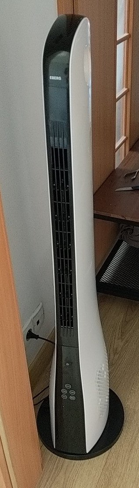
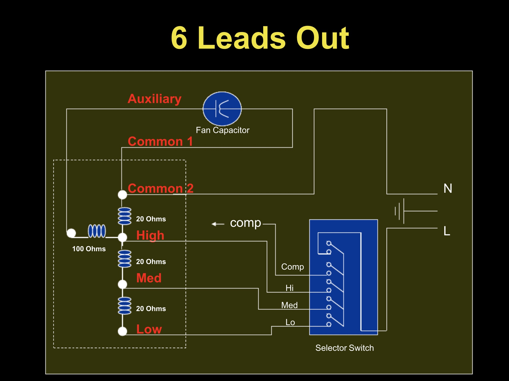
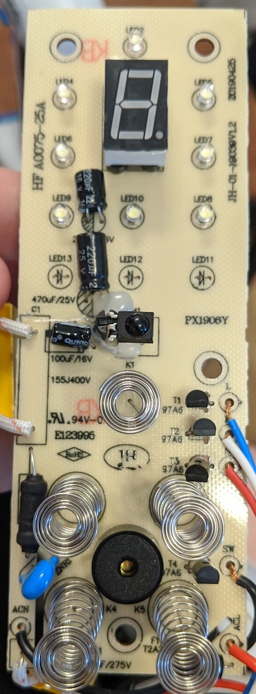
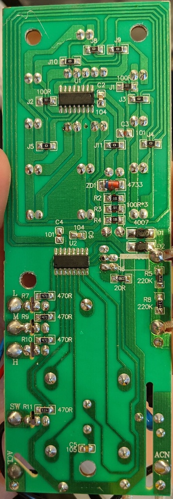
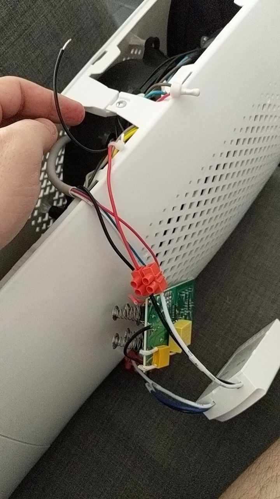
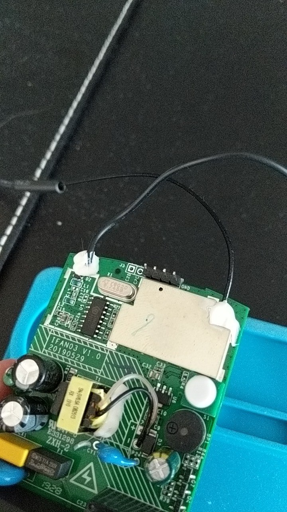

# mqtt-fan

### ⚡⚡⚡BIG FAT AC WARNING⚡⚡⚡
### This project deals with AC mains voltage. When handled improperly it can kill you, your loved ones, your dog, your cat, and everyone who's name starts with the letter E. Do NOT touch the device when it is powered by mains voltage.
### ALWAYS check your connections. ALWAYS isolate your connections and check for possible shorts. I am NOT responsible for any damage, be it physical or mental.
### Please, don't hurt yourself and stay safe

---

tl;dr: Convert your fan to be a home-assistant compatible smart fan

My wife wanted a new slim fan for the bedroom, and I've decided that it would need to be somewhat controllable via [home assistant](https://www.home-assistant.io). The original idea was to get one that would work with IR, and get a [Broadlink RM Mini 3](https://www.amazon.com/Broadlink-RM-Mini3-Universal-Controller-Compatible/dp/B01FK2SDOC)

So, the fan arrived looking like an enlarged PS5, along with the broadlink.

I tried setting it up using the [smartIR](https://community.home-assistant.io/t/smartir-control-your-climate-tv-and-fan-devices-via-ir-rf-controllers/100798) custom component, but it it turned out fast that it works kinda clumsy, and there's no way to reliably get the state of the device after restarting home assistant. So
I've decided to take a peek on the inside and see how it works.

---

## Fan setup

Upon inspection and some light googling, it turns out inside was a 6-wire AC fan, and this chart handily explains how it works

And this is how the control board looked

Breaking it down, there are 4 NPN transistors here, 3 of them controlling the fan speed - Low, Medium and High speed, passing on Live to the motor on the selected speed (labels L/M/H on the left side of the PCB), and the 4th one giving Live to the second motor which enables fan oscillation (labled SW on the PCB). The rest are buttons, a buzzer and the whole top part of the PCB is dedicated to the LCD display and status LEDs. The Neutral wire is bridged to both fans and the board with cable crimps.

At this point I was about to sit down at kicad, get a [nodeMCU](https://www.nodemcu.com/index_en.html), boot up [ESPHome](https://esphome.io), and start designing a replacement board. But it turns out I didn't have to

---

## Enter iFan03

The [Ifan03](https://sonoff.tech/product/wifi-diy-smart-switches/ifan03) is a replacement ceiling fan controller, which has 4 relays - 3 for different speeds of the fan, and one for the light that these lights usually have. This fits my needs almost perfectly:
- It has a built in RF433 interface and comes with a remote
- Runs on esp8285
- Supported ootb by [tasmota](https://templates.blakadder.com/sonoff_ifan03.html)

The only thing that's different, is that it only offers one neutral out for all 3 fan-controlling relays, but that's okay, since 2 of them are behind a 2.5uF and 3uF capacitors, which on AC power work "kinda" like resistors, effectively reducing the power. Hence, it's good enough to just connect the "High" speed from the fan to the fan output on the ifan03, although dependent on the fan, your "Medium" and "Low" fan speeds might be different than the original.

So all in all the connections go like this:

| ifan03             | Connects to       |
|--------------------|-------------------|
| AC Neutral (White) | AC Neutral        |
| AC Live (Black)    | AC Live           |
| Com (White)        | Nothing           |
| Light (Blue)       | Oscillation motor |
| Fan (Black)        | Fan (High)        |

I recommend using temporary connections at this point, and starting it up, to check if everything works right. I used light cable connectors for this

If everything is okay, you should be able to control your fan via the remote control. Don't be alarmed if for the first second the fan is on medium speed even though you requested low - this is the starting capacitor making sure your fan actually starts, and you can learn why that is [in this wonderful video](https://www.youtube.com/watch?v=hQ3GW7lVBWY)

---

## ESPHome
Flashing esphome on the device is really easy, it just needs some goldpins on the PCB (at the top) and a reliable FTDI device (but a raspberry pi or even an arduino uno will do as well!)
 Remember to do all of this WITHOUT powering the board with AC power, as [per the docs](https://tasmota.github.io/docs/Getting-Started/#hardware-preparation).

Once esphome is flashed, you should be able to control both the fan and the oscillation motor via the web interface, the RF remote control should work as well

---

## Home assistant
Once you're done with customizing your esphome firmware, it should be autodetected by Home Assistant

---

## What's next?
It would be nice to have at least a physical power button, there are still pins left on the ESP, and it supports capacitive buttons natively, so it's just a matter of soldering one onto it. Some status LEDs might be nice as well, but this would be enroaching on the custom PCB territory

---

## FAQ

- Does this work for 110VAC motors as well?

  Yes, but you most probably need to change the VAC capacitors as documented [here](https://tasmota.github.io/docs/devices/Sonoff-iFan03/). Otherwise your fan will be half-speed

- Will this work with my AC Fan?

  I don't know, but if you have an AC Fan, you should take a look at [this](https://www.scribd.com/presentation/236857799/Fan-Motor-Terminal-Identification)

- Will this work with my DC PWM Fan?

  No
